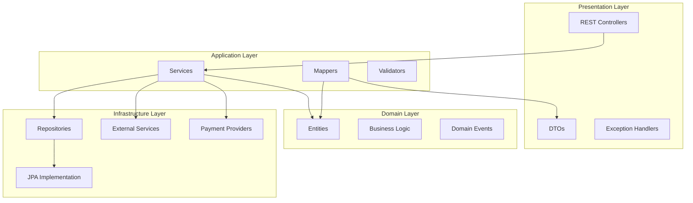
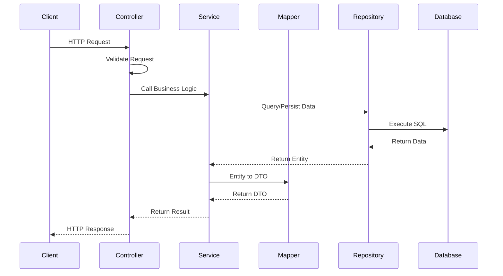
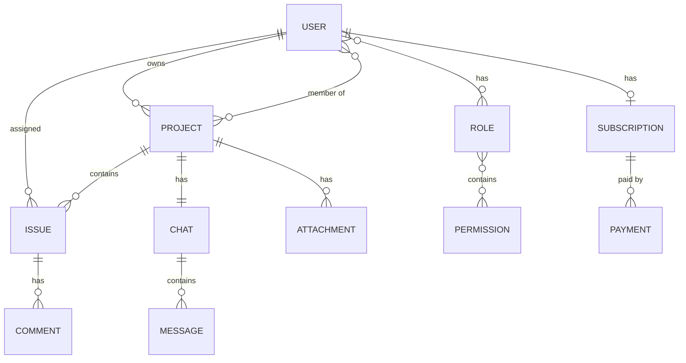
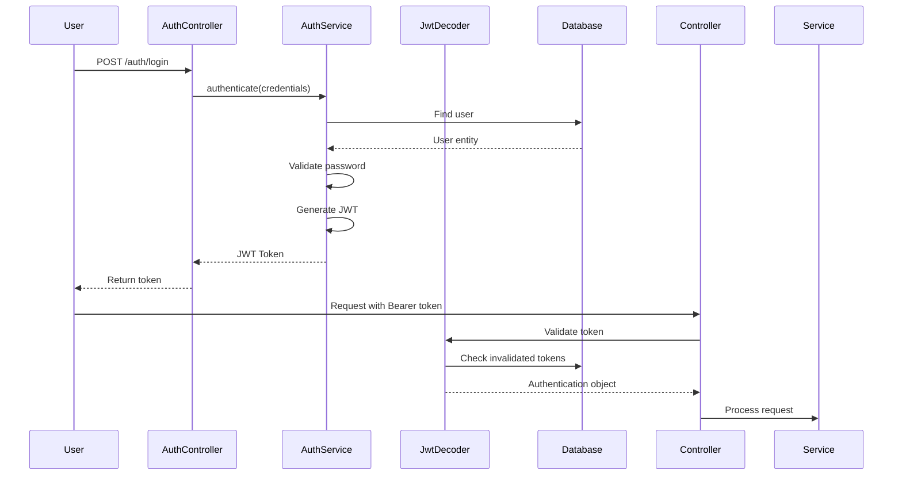
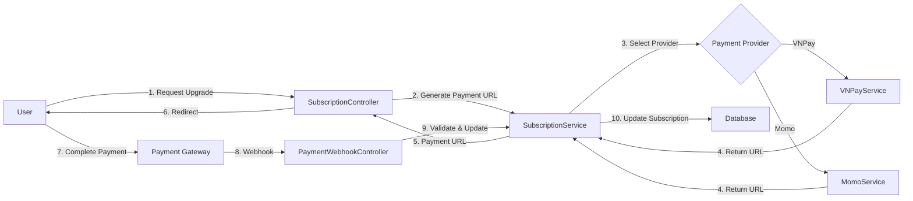
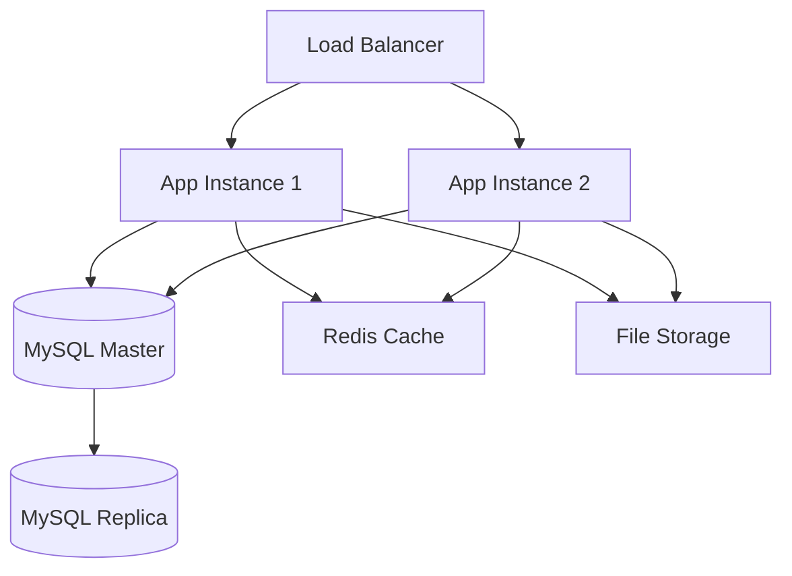

# Architecture Documentation

## System Overview

The Project Management System is a multi-layered Spring Boot application following **Clean Architecture** principles with **Domain-Driven Design (DDD)** patterns. The system provides project and issue tracking capabilities with team collaboration, subscription management, and payment integration.

---

## 🏛️ Architecture Layers



### 1. Presentation Layer
**Location**: `com.hieu.ms.controller`

**Responsibilities**:
- Handle HTTP requests/responses
- Request validation
- Authentication/Authorization
- API documentation (Swagger/OpenAPI)

**Key Components**:
- `UserController`: User management endpoints
- `ProjectController`: Project CRUD operations
- `IssueController`: Issue tracking endpoints
- `SubscriptionController`: Subscription management
- `AuthenticationController`: Login/logout

### 2. Application Layer
**Location**: `com.hieu.ms.service`

**Responsibilities**:
- Business logic orchestration
- Transaction management
- Data transformation (via MapStruct)
- Cross-cutting concerns

**Key Services**:
- `UserService`: User business logic
- `ProjectService`: Project operations
- `IssueService`: Issue management
- `SubscriptionService`: Subscription handling
- `PaymentService`: Payment orchestration

### 3. Domain Layer
**Location**: `com.hieu.ms.entity`

**Responsibilities**:
- Core business entities
- Domain rules and invariants
- Entity relationships

**Key Entities**:
- `User`: User accounts with roles
- `Project`: Projects with teams and issues
- `Issue`: Tasks/issues with assignments
- `Subscription`: Subscription plans
- `Payment`: Payment transactions
- `Role` & `Permission`: RBAC

### 4. Infrastructure Layer
**Location**: `com.hieu.ms.repository`, `com.hieu.ms.payment`

**Responsibilities**:
- Data persistence
- External service integration
- Payment gateway communication

**Key Components**:
- JPA Repositories
- Payment providers (VNPay, Momo)
- Email service
- File storage

---

## 🔄 Request Flow



---

## 🗄️ Database Schema

### Core Tables

#### Users
```sql
CREATE TABLE user (
    id VARCHAR(255) PRIMARY KEY,
    username VARCHAR(255) UNIQUE NOT NULL,
    password VARCHAR(255) NOT NULL,
    email VARCHAR(255) UNIQUE NOT NULL,
    first_name VARCHAR(255),
    last_name VARCHAR(255),
    dob DATE,
    project_size INT DEFAULT 0,
    created_at TIMESTAMP,
    updated_at TIMESTAMP,
    INDEX idx_user_username (username),
    INDEX idx_user_email (email)
);
```

#### Projects
```sql
CREATE TABLE project (
    id VARCHAR(255) PRIMARY KEY,
    name VARCHAR(255) NOT NULL,
    description TEXT,
    category VARCHAR(100),
    owner_id VARCHAR(255),
    created_at TIMESTAMP,
    updated_at TIMESTAMP,
    FOREIGN KEY (owner_id) REFERENCES user(id),
    INDEX idx_project_owner (owner_id),
    INDEX idx_project_category (category)
);
```

#### Issues
```sql
CREATE TABLE issue (
    id VARCHAR(255) PRIMARY KEY,
    title VARCHAR(255) NOT NULL,
    description TEXT,
    priority VARCHAR(50),
    status VARCHAR(50),
    project_id VARCHAR(255),
    assignee_id VARCHAR(255),
    due_date DATE,
    created_at TIMESTAMP,
    updated_at TIMESTAMP,
    FOREIGN KEY (project_id) REFERENCES project(id),
    FOREIGN KEY (assignee_id) REFERENCES user(id)
);
```

### Entity Relationships



---

## 🔐 Security Architecture

### Authentication Flow



### Authorization

**Role-Based Access Control (RBAC)**:
- Users have multiple roles
- Roles contain multiple permissions
- Permissions are checked at method level using `@PreAuthorize`

**Security Configuration**:
- OAuth2 Resource Server for JWT validation
- Custom JWT decoder with token blacklisting
- CORS configuration for cross-origin requests
- CSRF protection (disabled for stateless API)

---

## 💳 Payment Integration Architecture



### Payment Providers

#### VNPay Integration
- **Location**: `com.hieu.ms.payment.vnpay`
- **Configuration**: `VNPayConfig`, `VNPayProperties`
- **Features**: URL generation, signature validation, transaction verification

#### Momo Integration
- **Location**: `com.hieu.ms.payment.momo`
- **Features**: QR code payment, app payment, webhook handling

---

## 📊 Data Flow Patterns

### QueryDSL for Complex Queries

The system uses QueryDSL for type-safe, dynamic queries:

```java
// Example: User search with pagination
QUser user = QUser.user;
BooleanBuilder builder = new BooleanBuilder();

if (keyword != null) {
    builder.and(user.username.containsIgnoreCase(keyword)
        .or(user.email.containsIgnoreCase(keyword)));
}

Page<User> results = userRepository.findAll(builder, pageable);
```

### MapStruct for Object Mapping

Automatic DTO ↔ Entity mapping:

```java
@Mapper(componentModel = "spring")
public interface UserMapper {
    UserResponse toUserResponse(User user);
    User toUser(UserCreationRequest request);
}
```

---

## 🔧 Configuration Management

### Application Configuration
- **Security**: `SecurityConfig`
- **JPA Auditing**: `JpaAuditingConfig`
- **OpenAPI**: `OpenApiConfig`
- **Async Processing**: `AsyncConfig`
- **Caching**: `CacheConfig`
- **Payment Gateways**: `VNPAYConfig`, `PaypalConfig`

### Environment-Specific Configuration
- Development: Local MySQL, debug logging
- Testing: H2 in-memory database, Testcontainers
- Production: Production database, optimized settings

---

## 📨 Event-Driven Features

### Application Events
**Location**: `com.hieu.ms.event`

**Use Cases**:
- Send email notifications on project invitations
- Update subscription audit trail
- Trigger background tasks

---

## 🧪 Testing Strategy

### Unit Tests
- Service layer business logic
- Mapper transformations
- Utility functions

### Integration Tests
- Controller endpoints (MockMvc)
- Repository queries
- Database interactions with Testcontainers

### Test Coverage
- Minimum 80% code coverage (JaCoCo)
- Excludes: DTOs, Entities, Mappers, Configuration

---

## 🚀 Performance Optimizations

### Database Optimizations
- **Indexes**: Strategic indexes on frequently queried columns
- **Lazy Loading**: Avoid N+1 queries with proper fetch strategies
- **Query Optimization**: QueryDSL for efficient queries

### Caching
- **Spring Cache**: Method-level caching for frequently accessed data
- **Cache Providers**: Configurable (default: Simple)

### Async Processing
- **@Async**: Background email sending
- **Thread Pool**: Configured executor for async tasks

---

## 📦 Deployment Architecture

### Recommended Deployment



### Containerization

**Dockerfile** (recommended):
```dockerfile
FROM openjdk:21-jdk-slim
WORKDIR /app
COPY target/ms-0.0.1-SNAPSHOT.jar app.jar
EXPOSE 8080
ENTRYPOINT ["java", "-jar", "app.jar"]
```

---

## 🔍 Monitoring & Observability

### Logging
- **SLF4J + Logback**: Structured logging
- **Log Levels**: Configurable per package
- **Request Logging**: HTTP request/response logging

### Metrics (Future Enhancement)
- Spring Boot Actuator
- Prometheus integration
- Grafana dashboards

---

## 🛡️ Error Handling

### Exception Hierarchy
- `CustomException`: Base exception
- `ResourceNotFoundException`: 404 errors
- `ValidationException`: 400 errors
- `UnauthorizedException`: 401 errors

### Global Exception Handler
Centralized exception handling with consistent error responses.

---

## 🔄 Future Enhancements

1. **Microservices Migration**: Split into separate services (User, Project, Payment)
2. **Event Sourcing**: Implement event sourcing for audit trail
3. **CQRS**: Separate read/write models
4. **GraphQL**: Add GraphQL API alongside REST
5. **WebSocket**: Real-time notifications and messaging
6. **Elasticsearch**: Full-text search capabilities
7. **Docker Compose**: Multi-container orchestration
8. **Kubernetes**: Container orchestration for production

---

## 📚 Design Patterns Used

- **Repository Pattern**: Data access abstraction
- **Service Layer Pattern**: Business logic encapsulation
- **DTO Pattern**: Data transfer between layers
- **Builder Pattern**: Entity construction (Lombok)
- **Strategy Pattern**: Payment provider selection
- **Factory Pattern**: Object creation
- **Observer Pattern**: Event handling

---

## 🎯 Best Practices

1. **Separation of Concerns**: Clear layer boundaries
2. **DRY Principle**: Code reusability via services and mappers
3. **SOLID Principles**: Maintainable and extensible code
4. **API Versioning**: Prepared for future API versions
5. **Documentation**: Comprehensive Swagger/OpenAPI docs
6. **Code Quality**: Spotless formatting, JaCoCo coverage
7. **Security First**: JWT authentication, RBAC, input validation
