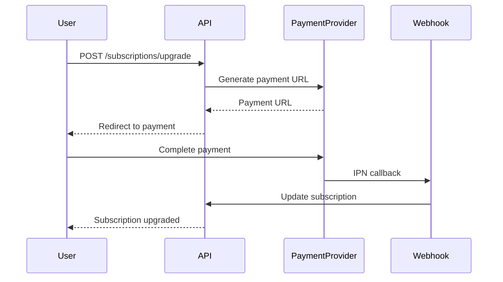

# 📦 Spring Boot Microservice - Project Management System

Hệ thống quản lý dự án được xây dựng với **Spring Boot 3.2.2** và **Java 21**, tích hợp thanh toán VNPay/Momo và áp dụng kiến trúc Feature-Based Modular.

## 🚀 Tính năng chính

### Quản lý dự án & Issue
- **Project Management**: CRUD dự án với phân loại và gắn tag
- **Issue Tracking**: Quản lý issue với trạng thái, độ ưu tiên và phân công
- **Team Collaboration**: Mời thành viên, quản lý team, nhắn tin real-time

### Người dùng & Phân quyền
- **Authentication**: Đăng ký/Đăng nhập với JWT (OAuth2 Resource Server)
- **Role-Based Access Control (RBAC)**: Phân quyền chi tiết theo Role & Permission
- **User Management**: Quản lý thông tin người dùng

### Thanh toán & Subscription
- **VNPay Integration**: Cổng thanh toán VNPay
- **Momo Integration**: Thanh toán qua ví điện tử Momo
- **Subscription Plans**: FREE, MONTHLY, ANNUAL với audit trail

### Tiện ích
- **Comments & Attachments**: Bình luận và đính kèm file
- **Email Notifications**: Thông báo qua email (Spring Mail + Thymeleaf)
- **Messaging**: Nhắn tin trong dự án

## 🛠️ Công nghệ sử dụng

| Thành phần | Công nghệ |
|------------|-----------|
| **Framework** | Spring Boot 3.2.2 |
| **Ngôn ngữ** | Java 21 |
| **Database** | MySQL 8.0+ (Production), H2 (Testing) |
| **ORM** | Spring Data JPA |
| **Security** | Spring Security, OAuth2 Resource Server |
| **Object Mapping** | MapStruct 1.5.5 |
| **Query Builder** | QueryDSL 5.0.0 |
| **Code Generation** | Lombok 1.18.30 |
| **API Docs** | SpringDoc OpenAPI 2.1.0 |
| **Testing** | JUnit 5, Testcontainers |
| **Code Quality** | Spotless, JaCoCo |
| **Email** | Spring Mail + Thymeleaf |

## 📁 Cấu trúc dự án

```
springboot-ms/
├── src/main/java/com/hieu/ms/
│   ├── MSApplication.java           # Main application entry point
│   ├── feature/                     # Feature-based modules
│   │   ├── attachment/              # File attachment management
│   │   ├── authentication/          # Login/Logout, token management
│   │   ├── comment/                 # Comment system
│   │   ├── invitation/              # Project invitation system
│   │   ├── issue/                   # Issue tracking
│   │   ├── message/                 # Messaging feature
│   │   ├── payment/                 # Payment integration
│   │   │   ├── momo/                # Momo payment provider
│   │   │   └── vnpay/               # VNPay payment provider
│   │   ├── project/                 # Project management
│   │   ├── role/                    # Role & Permission management
│   │   ├── subscription/            # Subscription & billing
│   │   └── user/                    # User management
│   └── shared/                      # Shared components
│       ├── configuration/           # App configuration (Security, JWT, etc.)
│       ├── constant/                # Constants & enums
│       ├── dto/                     # Shared DTOs
│       ├── entity/                  # Base entities
│       ├── event/                   # Application events
│       ├── exception/               # Custom exceptions & handlers
│       ├── service/                 # Shared services
│       └── validator/               # Custom validators
├── src/main/resources/
│   └── application.properties       # Application configuration
├── docs/                            # Documentation files
│   ├── implementation_plan.md
│   ├── optimization_comparison.md
│   ├── payment_factory_pattern.md
│   ├── refactoring_guide.md
│   └── walkthrough.md
├── pom.xml                          # Maven configuration
└── README.md
```

## 🔧 Cài đặt & Chạy

### Yêu cầu hệ thống
- **Java 21** trở lên
- **Maven 3.6+**
- **MySQL 8.0+**

### Cài đặt

1. **Clone repository**
```bash
git clone <repository-url>
cd springboot-ms
```

2. **Cấu hình Database**
```properties
# src/main/resources/application.properties
spring.datasource.url=jdbc:mysql://localhost:3306/your_database
spring.datasource.username=your_username
spring.datasource.password=your_password
```

3. **Cấu hình Payment (Tùy chọn)**
- **VNPay**: Cập nhật thông tin tại `VNPayProperties.java`
- **Momo**: Cập nhật thông tin tại `MomoConfig.java`

4. **Build & Run**
```bash
# Build project
mvn clean install

# Chạy ứng dụng
mvn spring-boot:run
```

Ứng dụng sẽ chạy tại `http://localhost:8080`

## 📚 API Documentation

Sau khi chạy ứng dụng, truy cập:

- **Swagger UI**: http://localhost:8080/swagger-ui.html
- **OpenAPI JSON**: http://localhost:8080/v3/api-docs

## 🎯 API Controllers

| Controller | Endpoint | Mô tả |
|------------|----------|-------|
| `UserController` | `/api/users` | Quản lý người dùng |
| `ProjectController` | `/api/projects` | Quản lý dự án |
| `IssueController` | `/api/issues` | Quản lý issue |
| `SubscriptionController` | `/api/subscriptions` | Quản lý gói đăng ký |
| `AuthenticationController` | `/api/auth` | Đăng nhập/Đăng xuất |
| `RoleController` | `/api/roles` | Quản lý role |
| `PermissionController` | `/api/permissions` | Quản lý permission |
| `MessageController` | `/api/messages` | Nhắn tin |
| `CommentController` | `/api/comments` | Bình luận |
| `AttachmentController` | `/api/attachments` | File đính kèm |
| `InvitationController` | `/api/invitations` | Mời thành viên |
| `SubscriptionAuditController` | `/api/subscription-audits` | Audit subscription |
| `PaymentWebhookController` | `/payment/webhook` | Webhook thanh toán |

## 💳 Payment Flow



### Supported Payment Providers
- **VNPay**: Cổng thanh toán phổ biến tại Việt Nam
- **Momo**: Ví điện tử Momo

## 🧪 Testing

```bash
# Chạy tất cả tests
mvn test

# Chạy tests với coverage report
mvn clean test jacoco:report
```

Coverage report: `target/site/jacoco/index.html`

## 🎨 Code Formatting

```bash
# Kiểm tra format
mvn spotless:check

# Áp dụng format
mvn spotless:apply
```

## 🔒 Security

### JWT Authentication
- Token được validate qua OAuth2 Resource Server
- Hỗ trợ token invalidation

### RBAC
- User → nhiều Roles
- Role → nhiều Permissions
- Permission-based access control trên từng endpoint

## 🚀 Production Deployment

```bash
# Build production JAR
mvn clean package -DskipTests

# Run JAR
java -jar target/ms-0.0.1-SNAPSHOT.jar
```

## 📝 Documentation

Tham khảo thêm trong thư mục `docs/`:
- `implementation_plan.md` - Kế hoạch triển khai
- `optimization_comparison.md` - So sánh tối ưu hóa
- `payment_factory_pattern.md` - Factory Pattern cho Payment
- `refactoring_guide.md` - Hướng dẫn refactoring

## 👨‍💻 Author

**Hieu** - Developer

## 📄 License

MIT License
